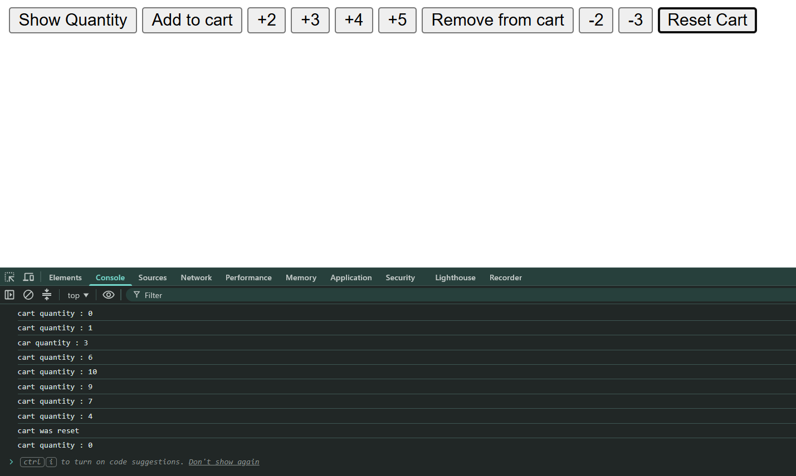

# Cart Quantity 🛒

A simple cart quantity manager built with vanilla JavaScript.
Add, remove, and reset items in the cart with a maximum limit of 10.

---

## Features
- ➕ Add 1, 2, 3, 4, 5 items to cart
- ➖ Remove 1, 2, 3 items from cart
- 🔄 Reset cart to 0
- ⚠️ Alerts when cart is full (max 10)
- ⚠️ Alerts when not enough items to remove

---

## Tech Used
- HTML
- JavaScript (Vanilla)

---

## How to Run
1. Clone the repo
2. Open `index.html` in your browser
3. Open console to see cart quantity updates

---

## Screenshot

---

## Live Demo
[Click Here](https://piyushdhakad001.github.io/Mini-projects/Cart-Quantity/index.html)

---

Made by **Piyush** 🚀