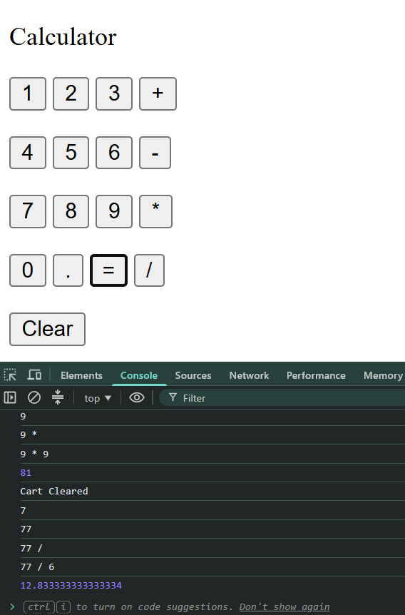

# Calculator 🧮

A simple calculator built with vanilla JavaScript.
Supports basic arithmetic operations like addition, subtraction, multiplication, and division.

---

## Features
- ➕ Addition
- ➖ Subtraction
- ✖️ Multiplication
- ➗ Division
- 🔢 Decimal support
- 🔄 Clear calculation
- ✅ Evaluate result with `=`

---

## Tech Used
- HTML
- JavaScript (Vanilla)

---

## How to Run
1. Clone the repo
2. Open `index.html` in your browser
3. Open console to see calculation updates

---

## Screenshot

---

## Live Demo
[Click Here](https://piyushdhakad001.github.io/Mini-projects/calculator/calculator.html)

---

Made by **Piyush** 🚀